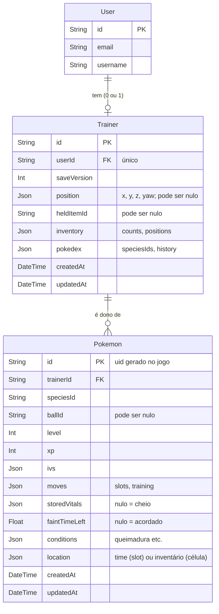

# 🚀 Versão 0.0.44 — Salvar o jogo

## Resumo

O progresso do treinador passa a ficar no banco (Prisma + Postgres), ligado à
conta. Ao fechar e abrir o jogo, o jogador encontra tudo como deixou:

- **Pokémon** (time e inventário): espécie, Pokébola em
  que foi capturado, nível, XP, IV, golpes (slots, treino e domínio), vida e
  energia guardadas, desmaio e as condições guardadas na bola (queimadura).
- **Inventário de itens**: quantidades e posições na grade.
- **Posição e direção do treinador**, **item na mão** e **Pokédex**
  (espécies escaneadas e histórico).
- **Salva sozinho**: de tempos em tempos (só se algo mudou), logo depois de
  uma captura e ao fechar ou esconder a aba. **Carrega ao entrar.**
- **Primeira entrada** (sem save): o kit de teste de sempre (042).
- O formato salvo tem **número de versão** e migração explícita.
- Debug: botão para **apagar o save** e voltar ao kit de teste.

Versão: `0.0.44` (`package.json`). Branch: `feature/044-salvar-o-jogo`.

> **Números deste doc são fictícios (ilustrativos).** O valor de verdade é o
> do campo citado (config).

---

## O que já existe (ponto de partida)

- **Banco**: Prisma 5 + Postgres; o `schema.prisma` só tem as tabelas do
  Better Auth (`User`, `Session`, `Account`, `Verification`).
- **Login**: `src/app/(auth)/layout.js` já exige sessão (sem ela, vai para o
  login). `auth.api.getSession` serve também numa rota de API.
- **zod** instalado (v4).
- **Mundo**: `core/world/world.js` cria o mundo e o treinador **ao ser
  importado** e já entrega o kit de teste (`giveStartingKit`: `STARTING_ITEMS`
  + um Pokémon de cada espécie, `STARTER_PARTY` no time).
- **Estado a salvar, todo em traits:**
  - treinador: `Inventory` (`counts`, `positions`), `HeldItem`,
    `PokedexEntries`, `ScanHistory`; time = relações `PartySlots`;
  - cada Pokémon (`Pokemon` + `OwnedBy`): `Pokemon` (`speciesId`, `ballId`),
    `IndividualValues`, `CreatureLevel`, `CreatureMoves` (`slots`,
    `training`), `StoredVitals`, `StoredFaint`, `StoredConditions`, e o lugar:
    `PartySlots` (time), `InventoryCell` (grade) ou `BallOnGround` (chão).
- **Criação de Pokémon**: `criarPokemon` já aceita o estado de um Pokémon que
  já existia (IV, nível/XP, golpes) — usado pela captura (043).
- **Não existe** fase de jogo `loading`, adapter de persistência nem rota de
  API do jogo.

---

## Decisões (com o usuário)

1. **Banco normalizado**: uma tabela do treinador e **uma linha por Pokémon**
   — prepara a troca da 071 (o Pokémon só muda de dono numa transação).
2. **O que entra além do roadmap**: Pokédex (espécies e histórico), item na
   mão e a **posição e direção do treinador** — pedido depois do teste:
   "ficou estranho sempre aparecer no meio do mapa". Volta na posição salva
   exata (ela vem da física, não fica dentro do chão). Uma folga de meio
   metro acima foi tentada e saiu: o treinador aparecia flutuando e caía
   ao entrar. Save sem posição (de antes dela) começa no ponto inicial. Reaparecer no Pokécenter ao ser derrotado continua na 060.
3. **Quando salva** — como nos jogos online:
   1. **de tempos em tempos** (`GAME_CONFIG.SAVE.AUTOSAVE_INTERVAL`), só se o
      estado mudou desde o último envio;
   2. **na hora** depois de uma captura (o equivalente às "ações
      importantes");
   3. **ao fechar ou esconder a aba** (`pagehide`/`visibilitychange`).
4. **Tempo fora congela**: com o jogo fechado nada anda (treino, desmaio,
   regeneração, condições). Resolve-se quando o jogo for para o servidor.
5. **Pokémon em campo ao salvar**: salvo como se tivesse sido recolhido — ao
   voltar, está na bola, com a vida e as condições que tinha.
6. **Debug**: botão no `DebugPanel` para apagar o save e recarregar com o kit
   de teste.
7. **Id próprio por Pokémon**, gerado no jogo e igual ao da linha no banco —
   continua o mesmo Pokémon na troca (071).
8. **Bola com Pokémon no chão não é salva** (captura com o inventário cheio):
   saiu do jogo, ela some, como qualquer item no chão.
9. **Falha ao carregar não entrega o kit de teste**: mostra o erro com
   "Tentar de novo" (ver "Começo do jogo").

---

## Arquitetura

### Banco (`prisma/schema.prisma`, migration nova)



`User` já existe (Better Auth; `Session`/`Account` ficam como estão). Apagar
a conta apaga o treinador, e apagar o treinador apaga os Pokémon (`Cascade`).

```prisma
model Trainer {
  id          String    @id @default(uuid())
  userId      String    @unique
  user        User      @relation(fields: [userId], references: [id], onDelete: Cascade)
  saveVersion Int
  position    Json?     // { x, y, z, yaw }
  heldItemId  String?
  inventory   Json      // { counts, positions }
  pokedex     Json      // { speciesIds, history }
  pokemon     Pokemon[]
  createdAt   DateTime  @default(now())
  updatedAt   DateTime  @updatedAt

  @@map("trainer")
}

model Pokemon {
  id            String   @id            // uid gerado no jogo (ver abaixo)
  trainerId     String
  trainer       Trainer  @relation(fields: [trainerId], references: [id], onDelete: Cascade)
  speciesId     String
  ballId        String?
  level         Int
  xp            Int
  ivs           Json
  moves         Json     // { slots, training }
  storedVitals  Json?    // null = cheio
  faintTimeLeft Float?   // null = não desmaiado
  conditions    Json?    // StoredConditions
  location      Json     // { kind: 'party', slot } | { kind: 'inventory', cell }
  createdAt     DateTime @default(now())
  updatedAt     DateTime @updatedAt

  @@index([trainerId])
  @@map("pokemon")
}
```

Campos que mudam de forma com o tempo (golpes, condições) ficam em `Json`,
validados por zod; o que vai ser consultado/filtrado (espécie, nível, dono)
é coluna.

### Id do Pokémon

`Pokemon` ganha `uid`: id estável do registro, o mesmo da linha no banco.
Gerado em `criarPokemon` por um **gerador injetado** (o core não chama
`crypto`/`Math.random`): o adapter registra `crypto.randomUUID`; os testes usam
um contador. Ao carregar, o `uid` vem do save.

### Formato salvo (`core/save/`, headless)

Um arquivo por domínio, cada um com `serialize*`/`deserialize*` explícitos
(regra 7, "save de estado de jogo"):

- `trainerSave.js` — inventário, item na mão, Pokédex;
- `pokemonSave.js` — um registro de Pokémon ↔ objeto salvo (inclui o lugar);
  criatura em campo vira o estado "recolhido" (vida, condições, desmaio que
  falta), **sem mexer no mundo**; Pokémon com `BallOnGround` fica de fora;
- `saveFormat.js` — `SAVE_VERSION`, schema zod do save inteiro e
  `migrateSave(data)`: versão antiga passa pelas migrações em ordem; versão
  desconhecida ou mais nova é **rejeitada** com mensagem clara;
- `snapshotSave(world, trainer)` — monta o save inteiro;
- `aplicarSave(world, trainer, save)` — action que recria os registros e
  devolve o treinador ao estado salvo.

### Começo do jogo (`core/world/world.js`)

`giveStartingKit` deixa de rodar no import. Entra
`prepararTreinador(world, trainer, save)`: com save, `aplicarSave`; sem save,
o kit de teste. O `GamePage` só monta o `Canvas`/loop depois disso, com uma
tela "Carregando…".

- **Falha ao carregar** (sem internet, banco fora do ar, sessão expirada,
  erro no servidor, save de versão que o jogo não conhece ou que não passa
  no zod): mostra o erro com "Tentar de novo" e **não** começa com o kit —
  senão o próximo autosave apagaria o save de verdade.

### Autosave

- `autosaveSystem` (passo fixo): conta `AUTOSAVE_INTERVAL` e emite o evento
  `SaveRequested`. `capturarSelvagem` também emite (captura concluída).
- O adapter drena `SaveRequested`, monta o `snapshotSave`, compara com o
  último enviado e só envia se mudou. Um envio por vez; se chegar pedido
  durante um envio, envia de novo ao terminar.
- Ao fechar/esconder a aba, o adapter envia direto com
  `fetch(..., { keepalive: true })`.
- Envio que falha: tenta de novo no próximo pedido; um aviso discreto na
  tela se continuar falhando.

### Adapter e rota

- `src/platform/persistence/saveClient.js` — `carregarSave()`,
  `enviarSave(save)`, `apagarSave()`; valida a resposta com o schema zod.
- `src/app/api/save/route.js` — `GET` (save do usuário ou `null`), `PUT`
  (grava), `DELETE` (debug). Confere a sessão, valida o corpo com zod e grava
  numa **transação**: atualiza o treinador, faz upsert dos Pokémon pelo `id`
  e apaga os que não vieram. Um `id` que já é de outro treinador é recusado.

### Constantes (`GAME_CONFIG.SAVE`)

`AUTOSAVE_INTERVAL` (ex.: 30 s, fictício).

### Testes

- Ida e volta de cada serializer (Pokémon no time/inventário, desmaiado,
  queimado, em campo → recolhido; bola no chão fica de fora; inventário;
  Pokédex).
- `migrateSave`: versão atual passa, desconhecida/mais nova é rejeitada.
- Schema zod: save inválido é recusado.
- `prepararTreinador`: com save restaura; sem save dá o kit.
- `autosaveSystem`: emite a cada intervalo, não roda pausado.
- Adapter: não envia sem mudança; um envio por vez.
- A rota com o banco: verificação manual.

---

## Como ficou (implementação)

- **Banco**: `Trainer` e `Pokemon` no `schema.prisma`, migration
  `20261008030510_salvar_o_jogo`. A tradução save ↔ linhas e a transação
  ficam em `src/shared/lib/saveRepository.js` (servidor, junto do `prisma.js`
  e do `auth.js`); a rota é `src/app/api/save/route.js`.
- **Core** (`src/core/save/`): `saveFormat.js` (versão, schema zod,
  `migrateSave`, `validateSave`), `pokemonSave.js`, `trainerSave.js` e
  `snapshotSave` (`index.js`). Actions em `core/actions/save.js`
  (`prepararTreinador`, `aplicarSave`, `pedirSave`); o kit de teste saiu do
  `world.js` para `core/actions/startingKit.js` (`darKitInicial`).
- **Traits** (`core/traits/components/save.js`): `SaveClock`,
  `SaveRequested` (pedido de save, tag) e `TrainerReady` (já preparado —
  carregar duas vezes não duplica nada).
- **`autosaveSystem`** na fase `events`, por último: pede por tempo e
  depois de `pokemonCaptured`.
- **Plataforma** (`src/platform/persistence/`): `saveClient.js` (rota +
  `migrateSave`), `autosave.js` (escuta `SaveRequested` com `world.onAdd`,
  monta o save numa microtask, um envio por vez, `keepalive` ao esconder a
  aba) e `pokemonUid.js` (UUID v4; sem `randomUUID` fora de HTTPS, monta com
  `getRandomValues`).
- **Página** (`(auth)/page.js`): carrega antes de montar o `Canvas`, com
  "Carregando…" e a tela de erro com "Tentar de novo"; aviso "Não foi
  possível salvar" no canto enquanto o save automático falhar.
  - Ajuste: o histórico da Pokédex que veio do save abria o menu na aba
    Histórico ao entrar (a HUD tratava como scan novo). Agora só reage a
    mudança depois de montar.
- **Debug** (F2): botão "apagar o save" — para o save automático, apaga e
  recarrega a página (entra com o kit).
- **Item ou espécie que não existe mais** no save fica de fora ao carregar.
- **Posição** (`Trainer.position`, migration
  `20261008032422_posicao_do_treinador`): `{ x, y, z, yaw }` da `Position`/
  `Rotation.y` do treinador, opcional no schema (não precisou subir a
  versão do save).
- **Verificação no banco** (Postgres local, usuário temporário apagado no
  fim): ida e volta igual, Pokémon que saiu do save é apagado, Pokémon de
  outro treinador recusa o save inteiro, apagar remove tudo.

---

## Carregamento inicial (pedido depois do teste)

Pedido do usuário: "quando iniciar o jogo os pokémons ficam no ar esperando
algo, até que eles caem" e "quando abro o inventário pela primeira vez, não
carrega todas as imagens".

- **Por que ficavam no ar**: o `<Canvas>` só monta a cena (e o `GameLoop`)
  quando todos os modelos `.glb` terminam; só aí o `GameLoop` começava a
  carregar a física (o WASM do Rapier), e sem física ninguém cai. Agora a
  tela "Carregando…" espera, junto com o save, `initPhysics()` — o `GameLoop`
  já encontra a física pronta.
- **Modelos**: `useGLTF.preload` de todas as espécies e itens no começo do
  carregamento (baixam enquanto o save chega), e o "Carregando…" fica por
  cima do jogo até a cena montar de verdade (`view/scene/SceneReady.jsx`,
  dentro do `<Canvas>`).
- **Sprites dos menus**: o `next/image` otimizado convertia cada sprite no
  servidor na primeira vez que aparecia (era essa a demora). Agora
  `images.unoptimized` no `next.config.mjs` (são sprites pequenos e GIFs) e
  todos os sprites de itens, espécies e golpes são baixados no carregamento
  (`view/preload/assetPreload.js`), com limite de tempo
  (`GAME_CONFIG.LOADING.SPRITE_TIMEOUT`) pra um servidor lento de fora não
  segurar a entrada.
- Física que não carrega vira erro na tela de "Carregando…", com "Tentar de
  novo".
- **Tela de carregamento** (pedido do usuário: "uma tela que varia o
  wallpaper… e algum indicador de carregamento"): `view/loading/
  LoadingScreen.jsx`, por cima de tudo até a cena montar.
  - Fundo sorteado entre `LOADING_WALLPAPERS` (`view/loading/
    loadingWallpapers.js`; por enquanto dois, em `public/assets/loading/`,
    convertidos pra WebP de no máximo 1920 px), trocando com fade a cada
    `GAME_CONFIG.LOADING.WALLPAPER_INTERVAL` s.
  - Barra com porcentagem e o que está carregando agora ("Carregando o
    save…", "Preparando a física…", "Baixando imagens…", "Baixando modelos
    3D…", "Montando o mundo…"): etapas do jogo contadas por
    `view/loading/loadingProgress.js` + arquivos do three.js (`useProgress`
    do drei). Nunca volta pra trás e só chega a 100% quando a tela some.
  - O erro de carregamento aparece na mesma tela, com "Tentar de novo".

---

## Fora de escopo

- Tempo passando com o jogo fechado — servidor (Marco 4).
- Duas abas abertas na mesma conta: vale o último que salvou.
- Save no servidor e validação anti-trapaça — 070.
- Vários treinadores por conta.

---

## Etapas

- [x] Bump da versão para `0.0.44` e doc da feature.
- [x] Revisão do doc pelo usuário (decisões 2 e 3).
- [x] Tabelas `Trainer` e `Pokemon` + migration.
- [x] `Pokemon.uid` e o gerador injetado.
- [x] `core/save/`: serializers, formato, versão, migração, zod + testes.
- [x] `aplicarSave` e `prepararTreinador`; kit só sem save + testes.
- [x] Rota `/api/save` (GET/PUT/DELETE) com sessão e transação.
- [x] Adapter `saveClient` + autosave (`autosaveSystem`, `SaveRequested`,
      captura, fechar aba) + testes.
- [x] Tela "Carregando…" e erro com "Tentar de novo".
- [x] Botão de apagar o save no `DebugPanel`.
- [x] Posição do treinador no save.
- [x] Carregamento inicial: física, modelos e sprites antes de entrar.
- [x] Tela de carregamento com fundos e barra de progresso.
- [x] Teste no jogo pelo usuário.
- [x] Roadmap e backlog (wiki sem mudança, ver Critérios).

---

## Critérios de Conclusão

- [x] Primeira entrada numa conta sem save: kit de teste, e o save é criado.
- [x] Capturar, mudar o time, usar itens, subir de nível e treinar golpes;
      fechar e abrir: tudo igual (Pokémon, golpes, vida, desmaio, queimadura,
      bola de cada um, inventário, item na mão, Pokédex).
- [x] Pokémon em campo ao fechar volta na bola, com a mesma vida e condições.
- [x] Com o jogo fechado, nada anda (desmaio, treino, queimadura).
- [x] Falha ao carregar não apaga o save.
- [x] Save de versão desconhecida é recusado com mensagem clara.
- [x] Apagar o save pelo debug volta ao kit de teste.
- [x] `npm run build`, `npm run lint` e `npm test` passando (suíte inteira:
      181 arquivos, 1781 testes, com `--maxWorkers=2`; build feito numa
      cópia, por causa do `next dev` rodando).
- [x] Wiki: sem mudança — decisão do usuário, a feature é infraestrutura
      ("ficou apenas para dev").
